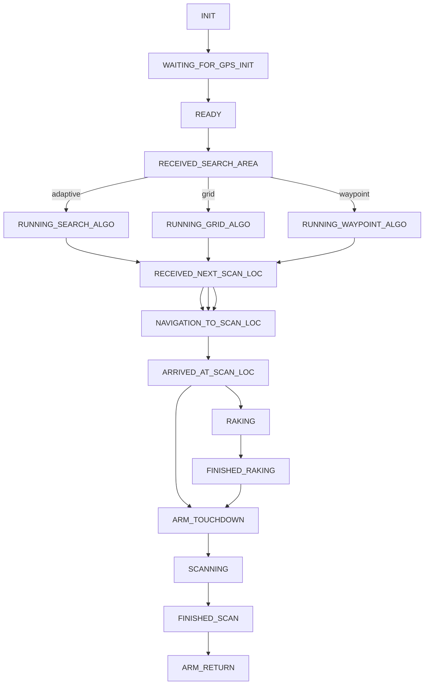

# Robot
## Run Info
### Start ROS services (on patrick)
```bash
# roscore
sudo systemctl start roscore.service 

# rover robotics
sudo systemctl start roverrobotics.service

# Basic Services for robot:
#   joystick -> cmd_vel
#   tf for base_link->gq7_link
roslaunch autonomy_manager basic.launch

# GPS
# Params file Info: https://github.com/LORD-MicroStrain/microstrain_inertial_driver_common/blob/6d62789b0492e28a0e4b86be8b4dc0e562d08a5e/config/params.yml
roslaunch microstrain_inertial_localization gq7_odom.launch

```
### Start Joystick publisher (on remote)
```bash
# joystick publisher
rosrun joy joy_node
```

## System Info
Intel NUC 13th Gen: 12.0V – 19 V

## Network Info
### HEBI Arm
It is connected to eth0 and uses a static IP configuration.

```
ROBOT IP, Netmask, Gateway: 192.168.0.200, 24, 192.168.0.1
HEBI IP : 192.168.0.102
```

## PXRF
It is connected to usb1, a USB ethernet module. It might use DHCP.
```
ROBOT IP, Netmask, Gateway: 192.168.7.10, 24, 192.168.7.1
PXRF IP : 192.168.7.2
```

## RTK GPS
### TF Measurements
COM -> FRONT_ANTENNA        (+0.1442, +0.1207, 0)
  x = 203.2 - 25 - 34 => 144.2   mm
  y = 132.715 - 12    => 120.715 mm

COM -> BACK_ANTENNA         (-0.1270, -0.1300, 0)
  x =         => 127 mm
  y = 96 + 34 => 130 mm

COM -> IMU                  (-0.0162, -0.0953, +0.0074)
  x = 22.2 - 6    => 16.2  mm
  y = 114 - 18.72 => 95.28 mm
  z =             => 7.37  mm


IMU -> FRONT_ANTENNA        (+0.1604, +0.2160, -0.0074)
IMU -> BACK_ANTENNA         (-0.1108, -0.0347, -0.0074)

### Topics
/gq7/ekf/odometry_earth : Earth ECEF Position
/gq7/mip/gnss_1/fix_info: fix_type = 0 if GNSS1 is fixed
/gq7/mip/gnss_2/fix_info: fix_type = 0 if GNSS2 is fixed
/gq7/ekf/llh_position   : Lat-Long-Altitude Data of EKF filter 
/gq7/gnss_1/llh_position: Lat-Long-Altitude Data of GNSS1
/gq7/gnss_2/llh_position: Lat-Long-Altitude Data of GNSS2
/gq7/ekf/dual_antenna_heading: Dual Antenna Heading
/gq7/ekf/status: dual_antenna_fix_type = "Dual Antenna Fixed" and status_flags has only 'Stable'
/gq7/ekf/odometry_map   : Odometry Map Position

# Manager 

## State Machine


## Code Logic
- DeployAutonomy is a list of (lat, lan) and returns success if path was successfully followed

---
# Scripts in Autonomy Manager
- adaptiveROS.py:
  - Adaptive Sampling Algorithm
- autonomy_teleop.py
  - defunct and replaced by autonomy_teleop_instant.py
- autonomy_teleop_instant.py
  - teleop
- boundaryCheck.py:
  - Contains one function __boundaryCheck()__
  - used in adaptiveROS.py, boundaryConversion.py and gridROS.py
- boundaryConversion.py
  - GPS related functions
  - used in manager.py, dataParser.py, test_adaptive.py and test.py
- bugAlgo.py
  - Bug Obstacle avoidance
  - has a function __forward_section()__ to get the forward obstacle section of the obstacle map, which is used in ObsAvoidance.py
  - the bug obstacle_avoidance() function seems to not be used @medium
- calibration.py
  - for fetching initial from GPS and some driving
  - could be replaced by the new RTK GPS module
  - run from the GUI and manager.py runs after calibration
- curve_graph.py
  - example code to plot Adaptive vs Boustrophedon
  - y label = EMD, not sure how they EMD values @medium
  - deprecated
- dataParser.py
  - sample code for using visualizer but the function __visualizer()__ is used only inside this file @medium
  - deprecated
- dummy_services.py
  - dummy services to emulate robot? @medium
  - deprecated
- environmentGeneration.py
  - functions to generate random distributions and random obstacles
  - __generateRandomDistribution()__ used in dataParser.py
- gridROS.py
  - Grid Search Algorithm
  - used in manager.py
- manager.py
  - State Machine
- ObsAvoidance.py
  - Obstacle Avoidance Algorithm
- postProcessing.py
  - plotting function __visualizer()__ used in adaptiveROS.py
  - Plotter 
  - is is used during robot execution or after? @medium
- teleop_drive.py
  - Teleop
    - only telop without autonomy teleop
    - deprecated
- test.py
  - test functions in boundaryConversion.py
  - deprecated
- test_adaptive.py
  - test adaptive in simulation @medium
  - 
- todo.md

# environmental_robots
## camera (Removed)
- camera.py
  - HEBI camera controller for Loaner HEBI robot
- hebi_teleop.py
  - HEBI teleop which might be something we don't use anymore
  - refer for arm helper functions
- pan_tile_ctrl.py
  - Loaner HEBI robot camera
- tools_arms_ctrl.py
  - Arm tool control not used
  - refer for arm helper functions

## gps_navigation
- gps_user_input.py
  - actual GUI code
  - Ian made changes for services and topics
- gps_navigation_rviz.py
  - might be defunct and not used
  - removed
- gps_navigation.py
  - future version of gps_navigation_rviz.py?
  - might be defunct and not used
  - some kind of PID controller to go to a location
  - removed
- gps_user_location.py
  - __read_location()__ is used by gps_user_input.py
- rake_measure.py
  - defunct @high
- test.py
  - some test code for parking brake
  - defunct @high
- tile.py
  - used in gps_user_input.py
- Removed all scripts
- Removed kraton and rake_scan pkgs
- 
kraton:
- camera pkg probably not needed @medium


autonomy_manager, gps_user_input.py and pxrf.py
- pxrf change timings


# TODO
- WAITING_FOR_CALIBRATION_TO_FINISH: Need to wait for RTK GPS to be initialized. May be change it to WAITING_FOR_GPS_INIT
- the first STANDBY state can be changed to INIT

# gps_navigation
The gps_navigation package contains the source code for waypoint navigation and GUI.
To launch: please run `roslaunch gps_naviation navigate_no_rviz.launch`

The following files in the src are used:

	gps_user_location.py:
It both parses the locations.csv to extract the coordinate information. It can also take the input from the user and store the coordinate in the locations.csv file so that it can be easily accessed in the future

	gps_user_input.py:
The main GUI that uses PyQT as the library that displays the regional map. It allows the user to place pins on the map, control pxrf, monitor robot status, etc

	gps_navigation.py:
The main controller for waypoint navigation. It includes both LQR and PID controllers. Currently only PID controller is used. LQR controller is not well tuned.


# Programming Environment

## Terminal Info
- zsh is the default terminal. 
- Instead of .bashrc, use .zshrc file to add aliases, source rosfiles, etc
- Run `tmux` after ssh to easily create new tmux session. A tmux session allows you to create remote terminals wihtout having to repeatedly ssh again.

## Aliases
The following aliases use incremental search to list the packages, topics and nodes.
- rcd -> roscd
- rte -> rostopic echo
- rtinfo -> rostopic info
- rnkill -> rosnode kill

## Shortcuts:
- CTRL + Space : Accept autosuggestion in the terminal
- CTRL + L : Clear terminal
- CTRL + R : Incrementally search history
- ` is the prefix key for tmux. After pressing the prefix key, press the following for:
  - | : Split current terminal horizontally
  - -- : Split current temrinal vertically
  - c : New terminal
  - x : Close current terminal
  - s : Switch session


# Links
1. [Flipper Rover Pro](https://roverrobotics.com/products/flipper-pro-unmanned-ground-vehicle-ros2-robot)
2. [RTK GPS](https://s3.amazonaws.com/files.microstrain.com/GQ7+User+Manual/user_manual_content/RTK/3DM%20RTK%20Integration.htm)
3. [Clifford Parts for RTK GPS](https://cmu.app.box.com/file/983972334542?s=4fbow8q6s7l7qhiz32eurrs9au0b984r)
4. [Sparkfun Basetation](https://www.sparkfun.com/products/retired/19029)
5. [PXRF repo](https://github.com/robomechanics/PXRF)
6. [PXRF Vanta Specs](https://www.olympus-ims.com/en/xrf-analyzers/handheld/vanta/#!cms[focus]=cmsContent14332)
7. [Remote SSH Code Server](https://code.visualstudio.com/docs/remote/ssh)
8. [Hebi Python API](http://docs.hebi.us/tools.html#python-api)
9. [Measuring Antenna Offsets](https://s3.amazonaws.com/files.microstrain.com/GQ7+User+Manual/user_manual_content/installation/Antenna.htm#How)
10. [Calibrating Magnetometer](https://s3.amazonaws.com/files.microstrain.com/GQ7+User+Manual/user_manual_content/installation/Magnetometer%20Calibration.htm)
11. [GQ7 Module Specs](https://www.microstrain.com/sites/default/files/8400-0139%20REV%20B.pdf)
