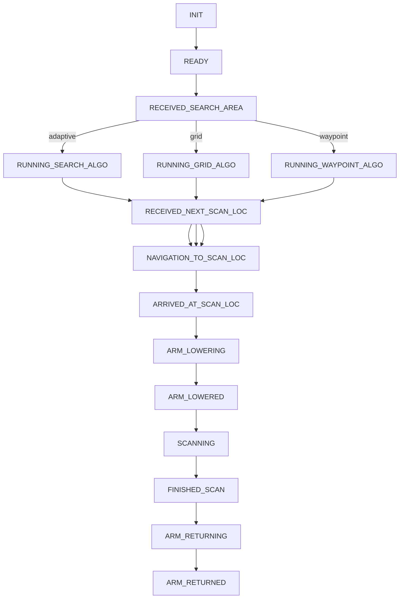

# Checklist
| Feature                 | Status             | Notes                                                                                                                    |
| ----------------------- | ------------------ | ------------------------------------------------------------------------------------------------------------------------ |
| Code Setup              | ✅                  | Current script installs all dependencies for codebase                                                                    |
| ROS Services and Topics | :white_check_mark: | Made changes to arm touchdown, return and NIR sensing services on HEBI side                                              |
| Localization            | :heavy_check_mark: | Dual antenna GPS fixes onto satellite. Pose has larger error (~1m); need to have more precise IMU-antenna distance params |
| GUI                     | :heavy_check_mark: | PyQT GUI works. Working on Web GUI; ROS topics/services names can be found in `autonomy_manager/config/constants.yaml`                                                                                       |
| Navigation              | ❌                  | Need to tune movebase params under `robo_nav/config`                                                                                            |

# Todo
- [ ] Change antenna and IMU offsets in `robo_nav/launch/gq7_odom_hebi.launch`
- [ ] Web GPS GUI (ROS topics/services names can be found in `autonomy_manager/config/constants.yaml`)
- [ ] Tune movebase params under `robo_nav/config`

# Installation
Refer (setup.md)[setup.md]

# Robot
## Run Info
### Start ROS services
```bash
# Basic Services for robot:
#   Load all ROS Params
#   GPS Localization Nodes
roslaunch autonomy_manager hebi.launch

# All other robot nodes (arm_control, move_base, arm_camera, pxrf_comm)
mon launch autonomy_manager bringup.launch --log="/home/patrick/catkin_ws/src/logs/$(date '+%Y-%m-%d-%H:%M:%S').log" --stop-timeout=10

## System Info
- Intel NUC
- Two arms (sensor and auger)
- Ethernet port for internet
- Long range wifi creates a hotspot

### Notes
- A connected topic (published every sec) for each arm (sensor and auger) to tell you whether the arm is connected (using hebi-lookup)

## Requirements
### Python
jupyter matplotlib pandas ipympl shapely scikit-learnm tqdm libpysal esda pyqtdarktheme jupyter-matplotlib colorama

### ROS
ros-noetic-rtcm_msgs
ros-noetic-nmea_msgs
ros-noetic-mavros
ros-noetic-move-base 
ros-noetic-move-base-msgs
git clone https://github.com/xqms/rosfmt.git
rosdep install --from-paths src --ignore-src -r -y
```

# Manager
## State Machine 
> `autonomy_manager/src/manager.py`



# Programming Environment
## Terminal Info
- zsh is the default terminal. 
- Instead of .bashrc, use .zshrc file to add aliases, source rosfiles, etc
- Run `tmux` after ssh to easily create new tmux session. A tmux session allows you to create remote terminals wihtout having to repeatedly ssh again.

## Aliases
The following aliases use incremental search to list the packages, topics and nodes.
- rcd -> roscd
- rte -> rostopic echo
- rtinfo -> rostopic info
- rnkill -> rosnode kill

## Shortcuts:
- CTRL + Space : Accept autosuggestion in the terminal
- CTRL + L : Clear terminal
- CTRL + R : Incrementally search history
- ` is the prefix key for tmux. After pressing the prefix key, press the following for:
  - | : Split current terminal horizontally
  - -- : Split current temrinal vertically
  - c : New terminal
  - x : Close current terminal
  - s : Switch session


# Links
1. Hardware
   1. [Flipper Rover Pro](https://roverrobotics.com/products/flipper-pro-unmanned-ground-vehicle-ros2-robot)
   2. [Hebi Python API](http://docs.hebi.us/tools.html#python-api)
   3. [Clifford Parts for RTK GPS](https://cmu.app.box.com/file/983972334542?s=4fbow8q6s7l7qhiz32eurrs9au0b984r)
2. Development
   1. [Remote SSH Code Server](https://code.visualstudio.com/docs/remote/ssh)
4. PXRF
    1.  [PXRF repo](https://github.com/robomechanics/PXRF)
    2.  [PXRF Vanta Specs](https://www.olympus-ims.com/en/xrf-analyzers/handheld/vanta/#!cms[focus]=cmsContent14332)
5. GQ7 GUI
   1. [RTK GPS](https://s3.amazonaws.com/files.microstrain.com/GQ7+User+Manual/user_manual_content/RTK/3DM%20RTK%20Integration.htm)
   2. [GQ7 Module Specs](https://www.microstrain.com/sites/default/files/8400-0139%20REV%20B.pdf)
   3. [Sparkfun Base Station](https://www.sparkfun.com/products/retired/19029)
   4. [Sparkfun Base Station Hookup Guide](https://learn.sparkfun.com/tutorials/sparkfun-rtk-facet-l-band-hookup-guide)
   5.  [MIP API](https://www.microstrain.com/sites/default/files/3dm-gx5-35_dcp_manual_8500-0068_0.pdf)
   6.  [Calibrating Magnetometer](https://s3.amazonaws.com/files.microstrain.com/GQ7+User+Manual/user_manual_content/installation/Magnetometer%20Calibration.htm)
   7.  [Measuring Antenna Offsets](https://s3.amazonaws.com/files.microstrain.com/GQ7+User+Manual/user_manual_content/installation/Antenna.htm#How)
   8.  Code
       1.  [GQ7 Params](https://github.com/LORD-MicroStrain/microstrain_inertial_driver_common/blob/6d62789b0492e28a0e4b86be8b4dc0e562d08a5e/config/params.yml#L114)
       2.  [GQ7 Params Examples](https://github.com/LORD-MicroStrain/microstrain_inertial/tree/ros/microstrain_inertial_examples)
       3.  [Clifford GQ7 Params](https://github.com/robomechanics/clifford_vesc/blob/main/config/rtk_microstrain.yaml)
       4.  [RTK Base Station](https://github.com/robomechanics/rtk_base)
