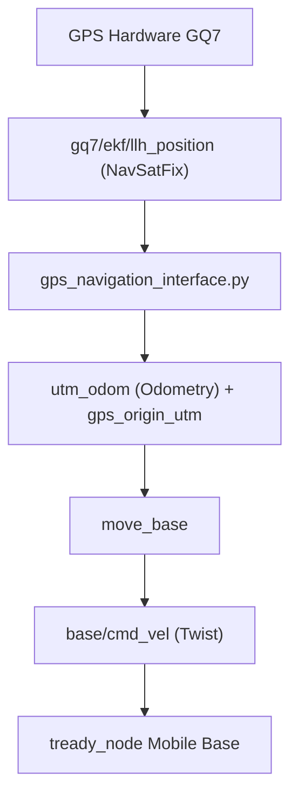

# Environmental Robot Package (CESAR Integration)

## Overview

This is a **stripped-down version** of the original CMU environmental robot repository, integrated as a submodule into the HEBI CESAR robot system. Only the essential components needed for autonomous navigation and waypoint generation algorithms have been retained.

**Original Repository:** CMU Robotics Institute Environmental Monitoring Robot  
**Current Branch:** Minimal integration branch for CESAR  
**Integration Date:** 2025

## Purpose in CESAR System

This submodule provides two critical components:

1. **robo_nav** - GPS-based localization and autonomous navigation
2. **autonomy_manager** - Adaptive and grid-based waypoint selection algorithms

These packages are used by the HEBI CESAR robot's `manager_node.py` to enable intelligent autonomous exploration and sensor placement.

## Package Structure

### robo_nav Package

**Location:** `environmental_robot/robo_nav/`

**Key Components:**

#### Launch Files
- `localization.launch` - GPS/IMU-based localization using MicroStrain GQ7
  - Loads GPS parameters from `config/gps_params.yaml`
  - Starts `gq7_odom.launch` (MicroStrain driver)
  - Runs `gps_navigation_interface.py` for coordinate conversion
  - Publishes GPS origin on latched topics

- `move_base.launch` - Autonomous navigation stack
  - Configures move_base for outdoor navigation
  - Loads costmap and planner parameters
  - Provides `/move_base` action server

#### Scripts
- `gps_navigation_interface.py` - GPS/UTM coordinate conversion
  - Subscribes to: `/gq7/ekf/llh_position`, `/gq7/ekf/odometry_map`
  - Publishes: `/utm_odom` (Odometry), `/gps_origin_utm` (Point), `/gps_origin_latlon` (NavSatFix)
  - Converts between WGS84 GPS and UTM coordinates

- `fake_gps.py` - GPS simulator for testing (not used in production)

#### Configuration Files
- `config/gps_params.yaml` - GPS navigation parameters
  ```yaml
  tf_base_link_frame: "base_link"
  tf_utm_odom_frame: "utm_odom"
  gps_odom_topic: "utm_odom"
  gq7_ekf_odom_map_topic: "/gq7/ekf/odometry_map"
  gq7_ekf_llh_topic: "/gq7/ekf/llh_position"
  gq7_ekf_status_topic: "/gq7/ekf/status"
  gps_moving_avg_topic: "/gps_moving_avg"
  gps_moving_avg_time: 1
  crs_GPS: "EPSG:4326"  # WGS84
  crs_UTM: "EPSG:3364"  # UTM Zone 17N
  ```

- `config/move_base/` - Move base configuration
  - `costmap_common_params.yaml` - Shared costmap settings
  - `global_costmap_params.yaml` - Global planner costmap
  - `local_costmap_params.yaml` - Local planner costmap
  - `base_local_planner_params.yaml` - DWA planner tuning

### autonomy_manager Package

**Location:** `environmental_robot/autonomy_manager/`

**Key Components:**

#### Python Modules
- `src/adaptive_sampling.py` - Adaptive waypoint selection algorithm
  - Uses PXRF sensor readings to identify areas of interest
  - Implements intelligent exploration strategy
  - Called by CESAR's `manager_node.py`

- `src/grid_search.py` - Grid-based search pattern
  - Generates systematic grid coverage
  - Ensures complete area coverage
  - Called by CESAR's `manager_node.py`

#### Configuration Files
- `config/constants.yaml` - **DEPRECATED** (kept for reference only)
  - Parameters have been migrated to `hebi_cesar/config/cesar_params.yaml`
  - GPS parameters moved to `robo_nav/config/gps_params.yaml`

#### Custom ROS Messages/Services
- `msg/` - Custom message definitions
- `srv/` - Custom service definitions (SetSearchBoundary, Waypoints, SetString, etc.)

## Integration with CESAR

### How CESAR Uses This Package

1. **Localization:**
   ```xml
   <!-- In hebi_cesar/launch/cesar.launch -->
   <include file="$(find robo_nav)/launch/localization.launch"/>
   ```
   - Provides GPS-based odometry
   - Publishes TF transforms (base_link → utm_odom)
   - Establishes GPS origin for local coordinate frame

2. **Navigation:**
   ```xml
   <!-- In hebi_cesar/launch/cesar.launch -->
   <include file="$(find robo_nav)/launch/move_base.launch"/>
   ```
   - Enables autonomous waypoint following
   - Provides `/move_base` action interface
   - Handles obstacle avoidance and path planning

3. **Waypoint Algorithms:**
   ```python
   # In hebi_cesar/scripts/manager_node.py
   from autonomy_manager.adaptive_sampling import AdaptiveSampling
   from autonomy_manager.grid_search import GridSearch
   
   self.adaptiveROS = AdaptiveSampling(...)
   self.gridROS = GridSearch(...)
   ```
   - Called when goal generation type is "adaptive" or "grid"
   - Returns next optimal waypoint based on sensor readings
   - Integrates with PXRF sensor data

### Data Flow


```mermaid
flowchart TD
    A[GPS Hardware GQ7] --> B["gq7/ekf/llh_position (NavSatFix)"]
    B --> C[gps_navigation_interface.py]
    C --> D["utm_odom (Odometry) + gps_origin_utm"]
    D --> E[move_base]
    E --> F["base/cmd_vel (Twist)"]
    F --> G[tready_node Mobile Base]
```

### Parameter Loading

GPS parameters are loaded in `cesar.launch`:
```xml
<rosparam command="load" file="$(find hebi_cesar)/config/cesar_params.yaml" />
```

This file includes GPS navigation parameters that are used by `gps_navigation_interface.py`.

---

## Key Differences from Original CMU Version

### Removed Components
- ❌ PyQt GUI (replaced by hebi-kit-webui)
- ❌ Original manager.py state machine (replaced by CESAR's manager_node.py)
- ❌ Arm control nodes (integrated into CESAR's sensor_arm_ctrl_node.py)
- ❌ PXRF communication nodes (integrated into CESAR's sensor packages)
- ❌ Original launch files (hebi.launch, bringup.launch - replaced by cesar.launch)
- ❌ Most of autonomy_manager/config/constants.yaml (migrated to CESAR configs)

### Retained Components
- ✅ robo_nav/launch/localization.launch
- ✅ robo_nav/launch/move_base.launch
- ✅ robo_nav/scripts/gps_navigation_interface.py
- ✅ robo_nav/config/ (GPS and move_base parameters)
- ✅ autonomy_manager/src/adaptive_sampling.py
- ✅ autonomy_manager/src/grid_search.py
- ✅ autonomy_manager/msg/ and srv/ (custom message definitions)

### Modified Components
- 🔧 gps_navigation_interface.py - Now publishes GPS origin on latched topics instead of setting ROS parameters
- 🔧 GPS parameters moved from constants.yaml to gps_params.yaml and cesar_params.yaml

## GPS/IMU Calibration

### Antenna and IMU Offsets

Edit `robo_nav/launch/gq7_odom.launch` to set antenna-to-IMU offsets:

```xml
<!-- Antenna 1 offset (meters) from sensor origin -->
<param name="antenna1_offset" value="[0.015, 0.0065, 0]"/>

<!-- Antenna 2 offset (meters) from sensor origin -->
<param name="antenna2_offset" value="[x, y, z]"/>
```

**To measure offsets:**
1. Locate GQ7 IMU position on robot
2. Measure distance to each GPS antenna
3. Use right-hand coordinate system: X=forward, Y=left, Z=up

### Magnetometer Calibration

If heading is incorrect:
```bash
# Use MicroStrain SensorConnect software
# Run magnetometer calibration routine
# Follow: https://s3.amazonaws.com/files.microstrain.com/GQ7+User+Manual/user_manual_content/installation/Magnetometer%20Calibration.htm
```

---

## Coordinate Systems

### GPS Coordinate Reference Systems

**WGS84 (EPSG:4326):**
- Standard GPS latitude/longitude
- Used for waypoint input and display
- Range: Lat [-90, 90], Lon [-180, 180]

**UTM Zone 17N (EPSG:3364):**
- Local planar coordinate system
- Used for navigation and path planning
- Units: meters (Easting, Northing)
- Origin: Set at first GPS "Full Nav" fix

## Troubleshooting

### GPS Not Getting Fix

1. Check GPS status:
   ```bash
   rostopic echo /gq7/ekf/status
   ```
   Should show: `filter_state: '"Full Nav"'`

2. Check sky visibility - GPS needs clear view of satellites
3. Wait 2-5 minutes for cold start
4. Check RTK base station connection (if using RTK)

### GPS Origin Not Published

1. GPS must achieve "Full Nav" state first
2. Check latched topics:
   ```bash
   rostopic echo /gps_origin_utm
   rostopic echo /gps_origin_latlon
   ```
3. Origin is published once when Full Nav is achieved

## Hardware Requirements

### GPS/IMU Sensor
- **Model:** LORD MicroStrain GQ7
- **Features:** Dual-antenna GNSS-INS, RTK capable
- **Driver Package:** microstrain_inertial (separate ROS package)
- **Connection:** USB serial
- **Topics:** /gq7/ekf/* (llh_position, odometry_map, status)

## File Organization

```
environmental_robot/
├── README.md                          # This file
├── autonomy_manager/
│   ├── config/
│   │   └── constants.yaml             # DEPRECATED - see cesar_params.yaml
│   ├── src/
│   │   ├── adaptive_sampling.py       # Adaptive algorithm
│   │   └── grid_search.py             # Grid search algorithm
│   ├── msg/                           # Custom messages
│   └── srv/                           # Custom services
└── robo_nav/
    ├── launch/
    │   ├── localization.launch        # GPS localization
    │   ├── move_base.launch           # Navigation stack
    │   └── gq7_odom.launch            # MicroStrain driver
    ├── scripts/
    │   ├── gps_navigation_interface.py # GPS coordinate conversion
    │   └── fake_gps.py                # GPS simulator
    └── config/
        ├── gps_params.yaml            # GPS parameters
        └── move_base/                 # Navigation parameters
```

## Related Documentation

- **Main CESAR System:** See `/home/hebi/workspaces/catkin_ws/src/README.md`
- **Web UI:** See `hebi-kit-webui/web_ui/README.md`
- **MicroStrain GQ7:** [Official Documentation](https://www.microstrain.com/sites/default/files/8400-0139%20REV%20B.pdf)
- **Move Base Tuning:** [ROS Wiki](http://wiki.ros.org/navigation/Tutorials/Navigation%20Tuning%20Guide)

## Support

For issues specific to:
- **CESAR integration:** Contact HEBI Robotics support
- **Navigation tuning:** See move_base documentation
- **GPS/IMU issues:** See MicroStrain documentation
- **Original CMU code:** https://github.com/robomechanics/environmental_robot
