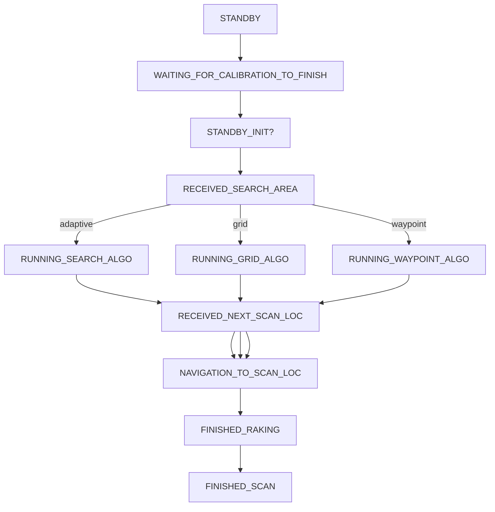

# Manager 

## State Machine

## Code Logic
- DeployAutonomy is a list of (lat, lan) and returns success if path was successfully followed

---
# Scripts in Autonomy Manager
- adaptiveROS.py: 
  - Adaptive Sampling Algorithm 
- autonomy_teleop.py
  - defunct and replaced by autonomy_teleop_instant.py
- autonomy_teleop_instant.py
  - teleop
- boundaryCheck.py:
  - Contains one function __boundaryCheck()__
  - used in adaptiveROS.py, boundaryConversion.py and gridROS.py
- boundaryConversion.py
  - GPS related functions
  - used in manager.py, dataParser.py, test_adaptive.py and test.py
- bugAlgo.py
  - Bug Obstacle avoidance
  - has a function __forward_section()__ to get the forward obstacle section of the obstacle map, which is used in ObsAvoidance.py
  - the bug obstacle_avoidance() function seems to not be used @medium
- calibration.py
  - for fetching initial from GPS and some driving
  - could be replaced by the new RTK GPS module
  - run from the GUI and manager.py runs after calibration
- curve_graph.py
  - example code to plot Adaptive vs Boustrophedon
  - y label = EMD, not sure how they EMD values @medium
- dataParser.py
  - sample code for using visualizer but the function __visualizer()__ is used only inside this file @medium
- dummy_services.py
  - dummy services to emulate robot? @medium
- environmentGeneration.py
  - functions to generate random distributions and random obstacles
  - __generateRandomDistribution()__ used in dataParser.py
- gridROS.py
  - Grid Search Algorithm
  - used in manager.py
- manager.py
  - State Machine
- ObsAvoidance.py
  - Obstacle Avoidance Algorithm
- postProcessing.py
  - plotting function _asla_visualizer()__ used in adaptiveROS.py
  - Plotter 
  - is is used during robot execution or after? @medium
- teleop_drive.py
  - Teleop
    - only telop without autonomy teleop
- test.py
  - test functions in boundaryConversion.py
- test_adaptive.py
  - test adaptive in simualtion @medium
- todo.md

# enviromental_robots
## gps_navigation
- camera.py
  - HEBI camera controller for Loaner HEBI robot
- hebi_teleop.py
  - HEBI teleop which might be something we don't use anymore
  - refer for arm helper functions
- pan_tile_ctrl.py
  - Loaner HEBI robot camera
- tools_arms_ctrl.py
  - Arm tool control not used
  - refer for arm helper functions